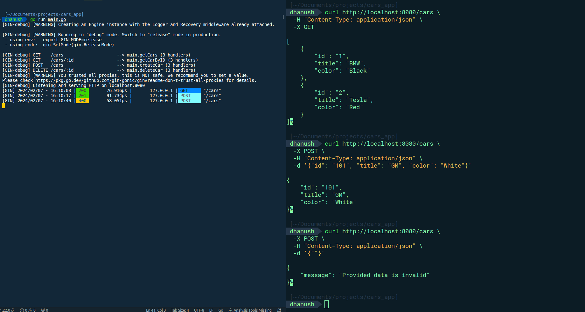

<h1 align="center">Tesing in Ginkgo and Gomega</h1>
 

_Have a go Rest API service which provides access to a car store. Have written E2E tests using Ginkgo and Gomega._

## Running API Service Locally

 API service working properly.

 Results after performing a E2E test

